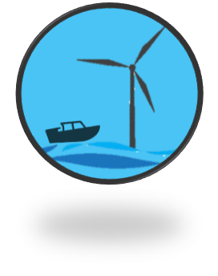
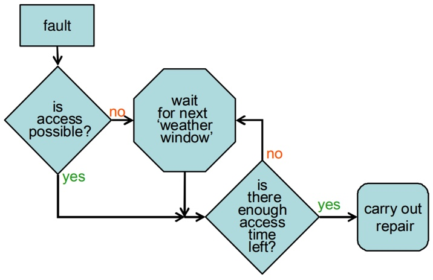
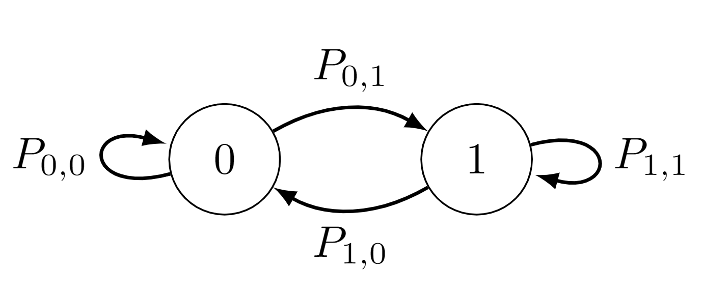

<!-- Improved compatibility of back to top link: See: https://github.com/othneildrew/Best-README-Template/pull/73 -->

<!--
*** Thanks for checking out the Best-README-Template. If you have a suggestion
*** that would make this better, please fork the repo and create a pull request
*** or simply open an issue with the tag "enhancement".
*** Don't forget to give the project a star!
*** Thanks again! Now go create something AMAZING! :D
-->

<!-- PROJECT SHIELDS -->
<!--
*** I'm using markdown "reference style" links for readability.
*** Reference links are enclosed in brackets [ ] instead of parentheses ( ).
*** See the bottom of this document for the declaration of the reference variables
*** for contributors-url, forks-url, etc. This is an optional, concise syntax you may use.
*** https://www.markdownguide.org/basic-syntax/#reference-style-links
-->

<!-- PROJECT LOGO -->
 

  

  <h3 align="center">PengWind</h3>

  

    Python package using stochastic methods to estimate resource quality, through traditional methods combined with a novel Discrete Time Markov Chain Model to model weather window and vessel access.
     
    <a href="https://github.com/kaiyaraby/statistical_access_modelling"><strong>Explore the docs »</strong></a>
     
     
    <a href="https://github.com/kaiyaraby/statistical_access_modelling/Examples_and_validation/Example">View Demo</a>
    ·
    <a href="https://github.com/kaiyaraby/statistical_access_modelling">Request Feature</a>
  

<!-- TABLE OF CONTENTS -->

  
Table of Contents

  <ol>
    <li>
      <a href="#about-the-project">About The Project</a>
      <ul>
        <li><a href="#built-with">Built With</a></li>
      </ul>
    </li>
    <li>
      <a href="#getting-started">Getting Started</a>
      <ul>
        <li><a href="#prerequisites">Prerequisites</a></li>
        <li><a href="#installation">Installation</a></li>
      </ul>
    </li>
    <li><a href="#usage">Usage</a></li>
    <li><a href="#roadmap">Roadmap</a></li>
    <li><a href="#contributing">Contributing</a></li>
    <li><a href="#license">License</a></li>
    <li><a href="#contact">Contact</a></li>
    <li><a href="#acknowledgments">Acknowledgments</a></li>
  </ol>

<!-- ABOUT THE PROJECT -->
## About The Project
The aim of this project is to present a framework for resource assessment, to enable to developers to use environmental data to identify high-value locations for wind farms.
The user can select an area over which to assess several KPIs including:
- Wind speed
  - Mean
  - Max
  - Min
  - Standard Deviation
  - Wind rose
    
- Access
    - Expected delay time
    - Probability of instant access
      
- Availability
- Downtime
- Annual Energy Production
- Operation & Maintenance Cost per kW

Traditionally, to incorporate the true variability of weather conditions, Monte Carlo simulations are often employed. However, these are computationally complex and limit the area over which resource, especially complex estimates such as Downtime, AEP, or O&M cost could be calculated. Through implementation of a number of novel computationally efficient models we have enabled calculation of these estimates quickly over large areas.
[![Product Name Screen Shot][product-screenshot]](https://example.com)

(<a href="#readme-top">back to top</a>)

(<a href="#readme-top">back to top</a>)

<!-- USAGE EXAMPLES -->
## Usage

Use this space to show useful examples of how a project can be used. Additional screenshots, code examples and demos work well in this space. You may also link to more resources.

_For more examples, please refer to the [Documentation](https://example.com)

(<a href="#readme-top">back to top</a>)

<!-- Modelling -->
## Modelling
Our key output is Operation & Maintenance Cost per Kw per year. To output this, users have the choice of using a 12MW reference turbine (NREL 2019), and failure/cost data as outlined in Carrol et al (2016).
The number of each type of repairs, their probability of occurrence, and their associated required operation time, vessel (and therefore associated threshold safe wave height and wind speed), and cost of repair are calculated. 
Thus cost is calculated as

$$Cost = \sum^M_{m=1} \lambda_m \cdot C_m$$

and downtime 

$$Downtime = \sum^M_{m=1} \lambda_m \cdot T_{op}(m) + T_{travel}(m, loc) + \mathbb{E}\left[T_{delay}\left(T_{op}(m)+T_{travel}(m, loc)\right)\right],$$

where
$m$ is the type of operation or maintenance required, $\lambda_m$ is the number of expected times $m$ must be carried out annually, $T_{op}(m)$ is the time required to carry out operation $m$,
$$T_{travel}(m, loc) = 2\cdot\frac{\text{Distance between location and coastline}}{\text{Speed of vessel required for operation } m}$$
is the required travel time to the location and 

$$\mathbb{E}\left[T_{delay}\left(T_{op}(m)+T_{travel}(m, loc)\right)\right]$$ 

is the expected delay time until a weather window the length of travel time and operation time occurs.

The time to travel to and from the asset is calculated based on its distance to the closest coast line, and speed of relevant vessel. A relevant extension would allow calculation of distance to closest port.

This time, and time to carry out operation are combined. This total vessel trip time is then feed into a Discrete Markov Chain Model, which calculates the expected time until a weather window will be reached where this trip can be safely conducted. This safe window requires that the threshold wave height and wind speed for the vessel are not exceeded for the entire duration. The Markov Chain Model is briefly described later in this section.

This downtime is summed with inactive power hours (where wind speed is below cut-in, or above cut-out speed), and divided by total hours to calculate availability

$$Availability = \frac{\text{Number of operating hours}-\text{Downtime}}{8760}.$$

Power for each hour is calculated using the power curve for the NREL 12MW reference turbine (or variable input) with 

$$
P = \begin{cases}
0 & \text{ if } v< v_{cut-in}\\
\frac{1}{2}AC_p\rho(v^3)\eta & \text{ if } v_{cut-in}\leq v<v_{rated}\\
P_{rated} & \text{ if } v_{rated}\leq v<v_{cut_out}\\
0 & \text{ if } v \geq v_{cut-out}
\end{cases}.
$$

The average energy yield is then scaled to remove estimated downtime
$$AEY = \sum^T_{t=1} P_t \cdot H_t \cdot \frac{\text{Number of Operating Hours}-\text{Downtime}}{\text{Number of Operating Hours}}.$$

Finally, the estimated cost of Operation and Maintenance is calculated as 

$$C/kw/yr = \frac{\text{Cost}}{\text{AEY}}.$$

### Markov Chain Model
When unscheduled maintenance or repairs need to be carried out, vessels may only be sent out when the weather conditions are safe for a vessel, for the time needed to travel and carry out the operation.
We may define three distinct states: 
- 0: Weather conditions unsuitable
- 1a: Access possible, but insufficient time remaining to carry out repair
- 1b: Access possible, and sufficient time remaining to carry out repair

Discrete Time Markov Chains (DTMCs) are characterised by a discrete time state space, where at each time the state may take a single value. In this report, we focus on two state models, as shown below. 

From a current state we may remain or move to the alternate state with probabilities determined by their related transition matrix:

$$
\pi = \begin{bmatrix}
    P_{0,0} & P_{0,1}\\
    P_{1,0} & P_{1,1}
\end{bmatrix}.
$$

We use this chain to model the accessibility,  $\mathbf{X} = \{X_1, X_2, \cdots, X_n\},$  where $X_t=1$ indicates that there is an access window beginning at time $t$.

This model assumes a constant probability of accessibility, $Pr(X_t=1)=P$, and of transition between states

$$Pr(X_t=i|X_{t-1}=j)=P_{i,j}.$$

(<a href="#readme-top">back to top</a>)

(<a href="#readme-top">back to top</a>)

<!-- CONTACT -->
## Contact

Kaiya Raby - kaiya.raby@strath.ac.uk

Project Link: [https://github.com/hacktheclimate]

(<a href="#readme-top">back to top</a>)

<!-- ACKNOWLEDGMENTS -->
## Acknowledgments

This package uses the methods outlined in  [Feuchtwang and Infield 2013](https://onlinelibrary.wiley.com/doi/abs/10.1002/we.1539). Further information about how these models have been developed can be found in the linked [document](https://github.com/statistical_access_modelling/Examples_and_validation/Derivation.pdf)

(<a href="#readme-top">back to top</a>)

<!-- MARKDOWN LINKS & IMAGES -->
<!-- https://www.markdownguide.org/basic-syntax/#reference-style-links -->
[contributors-shield]: https://img.shields.io/github/contributors/othneildrew/Best-README-Template.svg?style=for-the-badge
[contributors-url]: https://github.com/othneildrew/Best-README-Template/graphs/contributors
[forks-shield]: https://img.shields.io/github/forks/othneildrew/Best-README-Template.svg?style=for-the-badge
[forks-url]: https://github.com/othneildrew/Best-README-Template/network/members
[stars-shield]: https://img.shields.io/github/stars/othneildrew/Best-README-Template.svg?style=for-the-badge
[stars-url]: https://github.com/othneildrew/Best-README-Template/stargazers
[issues-shield]: https://img.shields.io/github/issues/othneildrew/Best-README-Template.svg?style=for-the-badge
[issues-url]: https://github.com/othneildrew/Best-README-Template/issues
[license-shield]: https://img.shields.io/github/license/othneildrew/Best-README-Template.svg?style=for-the-badge
[license-url]: https://github.com/othneildrew/Best-README-Template/blob/master/LICENSE.txt
[linkedin-shield]: https://img.shields.io/badge/-LinkedIn-black.svg?style=for-the-badge&logo=linkedin&colorB=555
[linkedin-url]: https://linkedin.com/in/othneildrew
[product-screenshot]: images/screenshot.png
[Next.js]: https://img.shields.io/badge/next.js-000000?style=for-the-badge&logo=nextdotjs&logoColor=white
[Next-url]: https://nextjs.org/
[React.js]: https://img.shields.io/badge/React-20232A?style=for-the-badge&logo=react&logoColor=61DAFB
[React-url]: https://reactjs.org/
[Vue.js]: https://img.shields.io/badge/Vue.js-35495E?style=for-the-badge&logo=vuedotjs&logoColor=4FC08D
[Vue-url]: https://vuejs.org/
[Angular.io]: https://img.shields.io/badge/Angular-DD0031?style=for-the-badge&logo=angular&logoColor=white
[Angular-url]: https://angular.io/
[Svelte.dev]: https://img.shields.io/badge/Svelte-4A4A55?style=for-the-badge&logo=svelte&logoColor=FF3E00
[Svelte-url]: https://svelte.dev/
[Laravel.com]: https://img.shields.io/badge/Laravel-FF2D20?style=for-the-badge&logo=laravel&logoColor=white
[Laravel-url]: https://laravel.com
[Bootstrap.com]: https://img.shields.io/badge/Bootstrap-563D7C?style=for-the-badge&logo=bootstrap&logoColor=white
[Bootstrap-url]: https://getbootstrap.com
[JQuery.com]: https://img.shields.io/badge/jQuery-0769AD?style=for-the-badge&logo=jquery&logoColor=white
[JQuery-url]: https://jquery.com 
